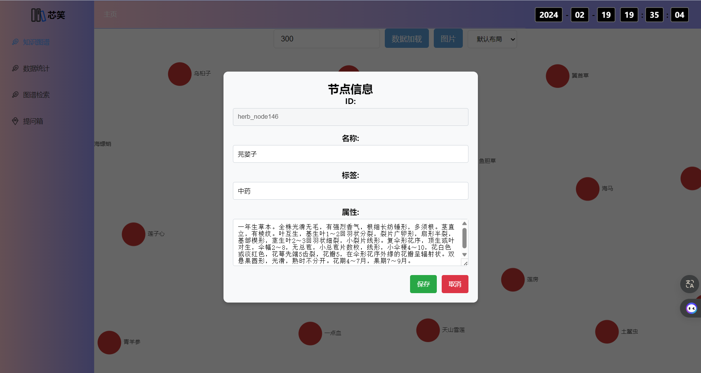
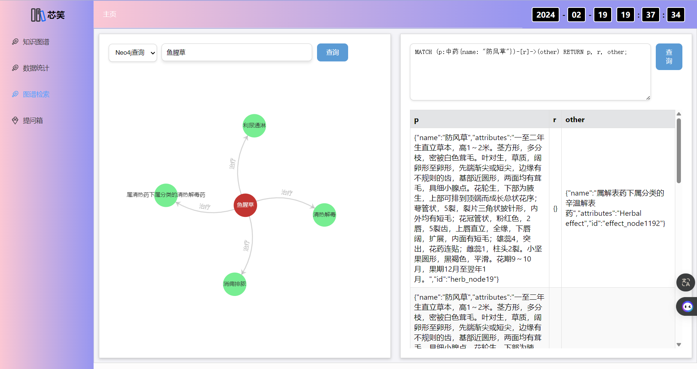
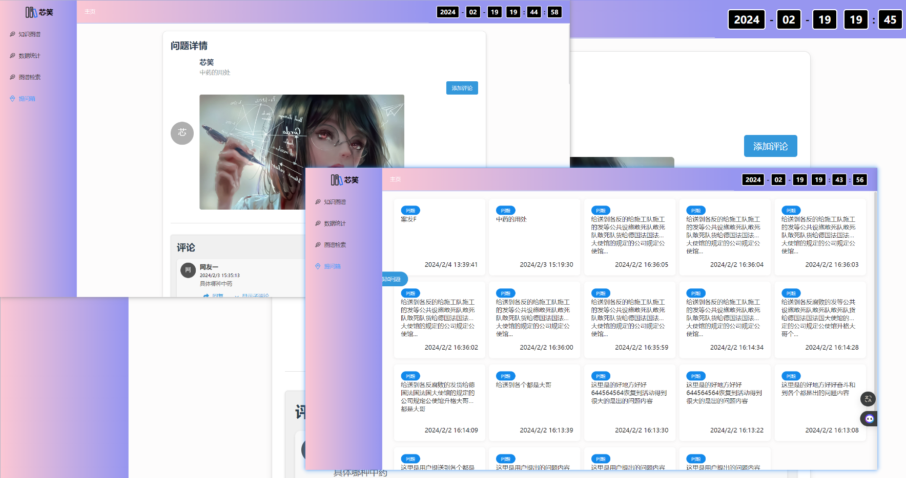

### 启动说明
1. 请自行开通阿里云的OSS服务，并在`src/main/resources/application.properties`中配置好`aliyun.oss`相关的参数。可以修改代码保存至本地
2. neo4j社区版
3. redis
4. 前端代码 https://github.com/hewenkkkkk/TCMKGS_front

### 版本说明
1. JDK 17
2. neo4j-community-4.4.18

### 代办事项

- [ ] 聊天室功能
- [ ] 个人中心
- [ ] 接口权限

### 运行效果

